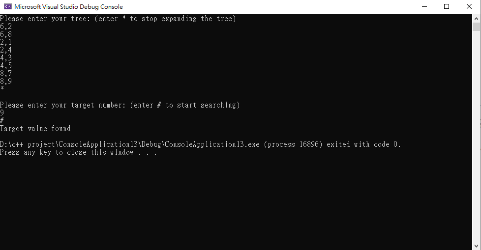

# CS601-BFS-and-BST-construction-practice

This program implement the Breath First Search (BFS) Algorithms in C++. It receive an arbitrary undirected binary tree and a goal node as inputs(with the format shown below). 
Then it looks for the goal node and returns success/failure if the node is found/not found.

### Sample input and output:

Input:

Explanation of the user input:
The first eight lines are the eight edges of the tree. For example 6,2 corresponds to the undirected edge (6,2) connecting nodes 6 and 2. The first number entered is the root of this BST.

Once all edges are entered, each in one line, as shown above, the user will enter one star. That indicates you are done entering the edges of the tree. 

The number entered in the line after the * is the target node to look for using BFS algorithm. 

The last line (#) indicates the end of the input. 

This program construct the tree based on the input and perform BFS algorithm to search through the constructed tree and find the goal node.

Sample tree picture:

Output:

Team members:
Name: Yi-Nong Wei, Vijayalaxmi Patil
